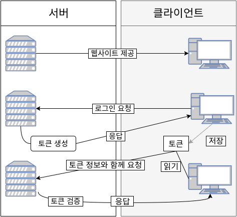

# Session 인증
## Session이란

* 세션과 다른 방식인 쿠키는 클라이언트가 정보를 저장하는 방식이지만 세션은 중요한 정보를 서버에서 관리하는 방식 중 하나이다.

* 클라이언트가 서버에 요청을 보낼 때, 서버는 저장한 세션 Id를 활용한다.

### 주의사항

* 클라이언트는 세션 Id를 쿠키로 저장하여 기억한다.

* 세션Id를 저장해놓은 쿠키를 요청할 때 헤더의 쿠키에 있는 세션 Id를 담아서 전송한다.

* 그 보낸 세션Id와 세션 저장소에 저장되어있는 세션Id를 비교하여 판단한다.

## 인증 방식

1. 사용자가 로그인을 한다.

2. DB에 있는 회원정보와 비교를 하여 맞으면 세션을 생성한다.

3. 그 만든 세션을 저장소에 저장하고 세션Id를 발급받는다.

4. 받은 세션Id를 응답으로 보낸다.

5. 클라이언트는 받은 세션Id를 쿠키로 저장한다.

6. 다음부터는 요청을 보낼때 헤더에 쿠키를 담아 보낸다.

7. 받은 쿠키에 있는 세션Id를 세션 저장소에 있는 세션과 비교하여 일치하면 유저정보가 담긴 세션을 가지고 응답을 보낸다.

### 단점

* 쿠키에 담긴 세션Id가 중요한 정보를 담고 있지는 않지만 만약에 세션Id가 탈취당하면 위장하여 정보를 요청할 수 있다.

* 서버에 세션 저장소를 따로 두는 거이기때문에 요청이 한번에 많은 요청이 들어오묜 부하가 심해진다.