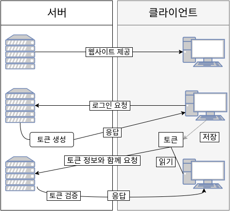

# Spring MVC
## Spring MVC란?

* Model, View, Controller 세가지 구성요소를 사용한다.

* 클라이언트가 보내는 HTTP 요청들을 처리하고 요청을 이용해 데이터를 처리하고 View를 이용해 html과 JSP를 return하는 프레임워크이다.

## Spring MVC의 장점

1. 여러 개발자가 참여하여 역할을 나눠 각각의 부분을 동시에 개발이 가능하다. 예를 들어 Model과 Controller는 Java를 쓰는 개발자가 개발을 하고 View부분은 UI관련된 개발자가 담당하여 개발을 하면 개발하는 시간을 단축 시킬 수 있다.

2. MVC 패턴을 사용하면 중복되는 코드들을 줄일 수 있고 웹이면 웹, 앱이면 앱을 View만 바꿔서 배포하게 되면 여러 곳에서 쓰일 수 있다.

## Spring MVC 단점

1. Model과 Controller,View 부분을 나눠서 개발하기 때문에 개발할 것이 많아지면 그만큼 파일 수가 많아지게 되고 비례하여 개발시간도 늘어난다.

2. 개발자가 적게 되면 많은 파일과 Model과 Controller,View를 옮겨가며 개발을 하게 되기때문에 개발시간과 유지보수가 용이하지않다.

## Spring MVC의 구조

> 주요 구조는 Controller, Model, View이지만 그 구성요소들을 유연하게 동작시키기 위해 다양한 것들이 존재한다.

* DispatcherServlet(Front Controller)

* Handler(Controller)

* ModelAndView

* ViewResolver

### Model

* 어플리케이션에서 데이터를 담당하고 Model부분에서 모든 데이터 정보를 가지고 가공하는 컴포넌트이다.

* 이 곳에는 유저가 사용하려는 데이터나 정보를 다 가지고 있어야되며, 이것을 Controller나 View쪽은 알 수 없어야 된다.

* 위의 이유를 더하자면 Controller가 Model과 View 사이에 위치함으로써 코드의 분리와 유연성을 유지하고 각 구성 요소들을 독립적으로 테스트할 수 있게 도와주기 떄문이다. 

### View

* 유저에게 보여지는 UI쪽이다.

* Model이 가지고 있는 정보들은 View에서 아예 알면 안된다.

* Controller도 예외가 아니라 Model과 똑같이 정보를 알면 안되고 View는 단지 보여지는 역할을 가지게 된다.

### Controller

* Model과 View 사이에 있어 매개체역할을 한다.

* Controller는 Model과 View의 정보를 알아야하고 변경사항이 생기더라도 유연하게 해결해야된다.

## Spring MVC의 흐름

* 위 사진을 통해 간단히 흐름을 알 수 있다.

1. 처음 클라이언트로 부터 애플리케이션 서버로 Request를 보낸다.

2. 그 요청을 먼저 프론트 컨트롤러라는 곳에서 받아 올바른 곳에 요청을 위임한다.

3. 그 위임된 요청을 받은 컨트롤러에서 요청을 비즈니스 로직에서 처리 한 결과를 Model에 담아 프론트 컨트롤러로 보낸다.

4. 받은 Model을 View에게 넘기고 그 정보를 사용하여 View를 응답 결과로 보낸다.

### DispatcherServlet

* HTTP 요청이 들어오면 가장 먼저 처리하는 Controller

* 클라이언트가 HTTP Request를 보내면 DispatcherServlet에 들어가 그 요청에 맞는 Controller를 지정해준다.

### Controller(Handler)

* DispatcherServlet에서 배정받은 Controller에서 HTTP Request로 받은 정보를 Model로 저장한다.

* HTTP Request를 받아서 HTTP가 보여줄 View Name을 지정하거나 바로 View를 띄울 수 있다.

* But View에 Model 데이터를 세팅하지않는다.

### ModelAndView

* 여기서 Model은 Map으로 데이터를 저장한다. HTTP Request를 분석하여 Key-value로 만들어 저장한다.

* 여기서 저장된 Model은 나중에 View를 위해 사용된다.

* 여기서 View와 View Name은 나중에 그릴 ViewResolver에서 View를 가르킨다.

* 오해할만한 것이 있는데 ModelAndView에서 View와 View Name이 ViewResolver에서 그릴 View를 지정하지만 데이터를 가지고 있는 View를 가르키는 건 아니다.

### ViewResolver

* 앞에서 ModelAndView를 처리한 것을 가지고 View를 그린다.

* 이때 처리된 View는 클라이언트에게 바로 보여지는 View이고 반환되는 View이다.

## 나의 생각

> 테코톡 MVC패턴에 대해 강의를 보았는데 내 기억으로는 옛날에 코드를 썼을 때 코드가 오류나 수정해야될때 코드를 싹다 갈아엎어야된다고 들었는데 그런 면에서 MVC패턴이 개발자들에게는 편리하겠지만 View로 띄울 수 있는 게 html또는 JSP라고 들어서 한계가 분명 존재한다고 생각합니다!

