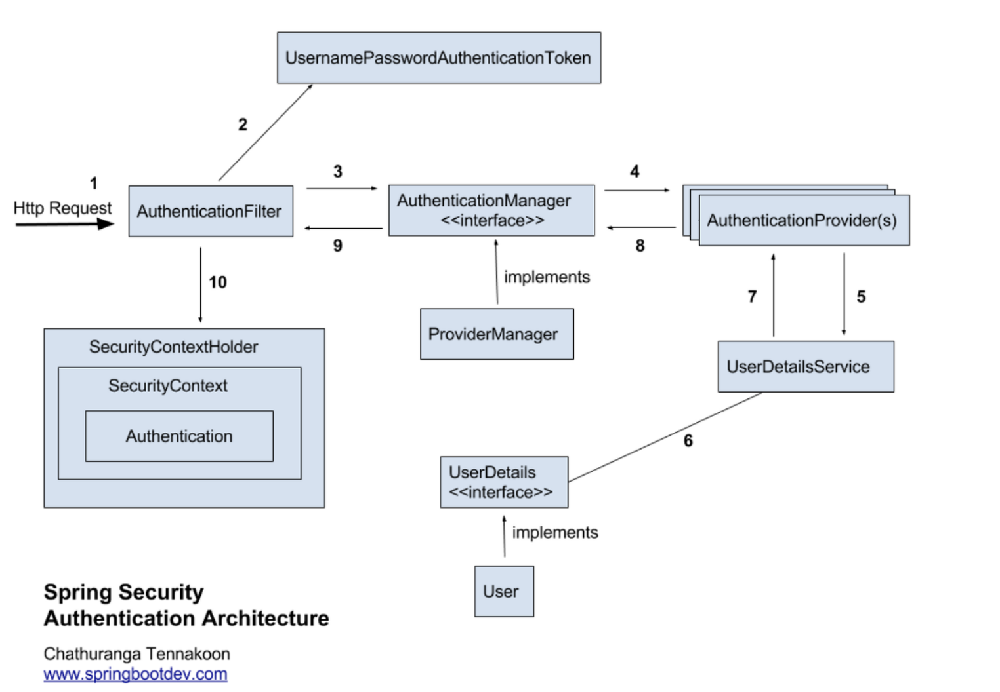

# 인증/인가
## 인증 / 인가이란

* 식별 가능한 정보로 이 유저가 등록되어있는지 선별하는 과정이다.

* 즉, 여기에 등록되어 있는 사람에게 서비스를 제공한다는 말이다.

* 위에서 인증을 완료한 사람에게 그에 맞는 적절한 권한을 부여하는 과정이다.

### 인증 방식

1. 세션 - 쿠키 방식
2. 토큰(JWT) 방식
3. OAuth

* Spring security는 credential 기반으로 인증을 진행한다.

* credential기반이란 이런 것들이 존재한다.
    * principal: 아이디
    * credential: 비밀번호

* 이러한 방법으로 인증하고 인가를 부여한다.

## Spring Security Architecture

1. 유저가 로그인을 하기 위해 요청을 보낸다.

2. 그 요청을 AuthenticationFilter에서 가로챈다.

3. 그 가로챈 정보를 가지고 UsernamePasswordAuthenticationToken을 생성한다.

4. 그 생성한 토큰 객체를 AuthenticationManager의 구현체인 ProviderManager로 전달한다.

5. 그 토큰을 가지고 AuthenticationProviders에서 맞는 정보가 있는 지 비교를 한다.

6. 비교하는 과정 중에 UserDetailsService로 정보를 넘겨 실제 DB에 그 유저정보가 있는지 확인하고 정보객체를 반환하여 AuthenticationProviders에서 비교를 한다.

7. 인증이 완료되면 인증된 객체를 반환한다.

8. 인증된 객체가 다시 AuthenticationFilter로 가서 SecurityContextHolder에 있는 SecurityContext에 Authentication에 저장된다.

## spring security 아키텍처에서 등장하는 주요 모듈

* SecurityContextHolder, SecurityContext, Authentication

    * 위에 흐름을 따라서 인증을 성공한 유저의 아이디, 패스워드를 Authentication에 저장한다.

    * 방금 유저의 정보가 저장된 Authentication을 SecurityContext에 넣어 저장한다.

    * 그 Authentication을 넣어 저장한 SecurityContext를 SecurityContextHolder에 담아서 보관한다.

* UsernamePasswordAuthentication
    * 유저의 ID가 principal의 역할을 하고 유저의 password가 credential의 역할을 한다.

* AuthenticationManager
    * 인증을 하는 부분은 이 곳에서 처리가 된다.

    * AuthenticationManager에 등록되어 있는 AuthenticationProvider에 의해서 처리를 한다.

* AuthenticationProvider
    * 실제 인증을 처리한다.

    * 인증하기 전에 Authentication 객체를 받아 인증을 한 객체를 반환하는 역할을 한다.

* ProviderManager
    * AuthenticationManager을 구현한 ProviderManager은 AuthenticationProvider를 구성하는 목록을 가진다.

* UserDetailsService
    * UserDetails 객체를 반환한다.

    * 보통 이것을 구현한 클래스에서 UserRepository를 주입받아서 DB와 연결한다.

* UserDetails
    * 인증을 완료한 UserDetails는 Authentication 객체를 구현한 UsernamePasswordAuthenticationToken을 생성하기 위해 사용된다.

* SecurityContextHolder
    * 보안 주체의 세부 정보를 포함해서 다른 프로그램의 보안 컨텍스트도 저장된다.

* SecurityContext
    * Authentication을 보관하는 역할을 한다.

    * Authentication을 저장하고 꺼내올 수 있는 곳이다.

